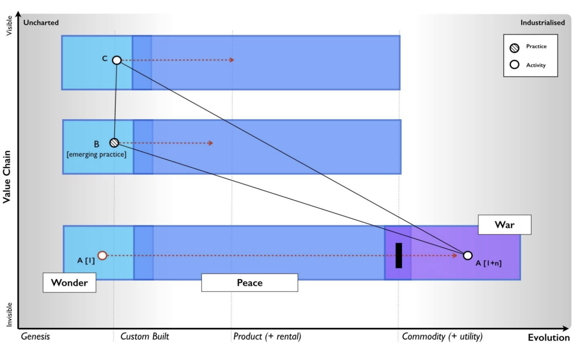
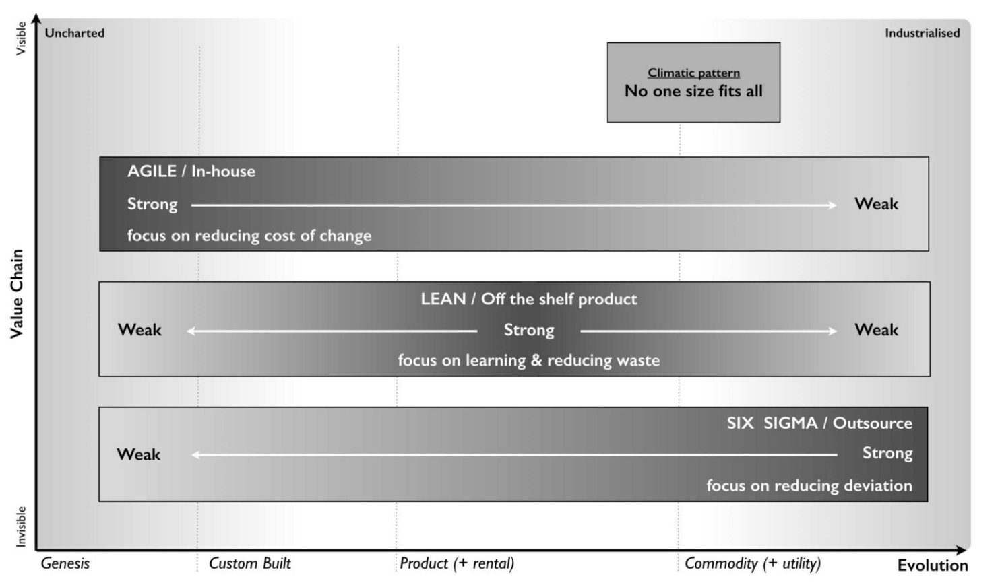

# How to build new software fast!

As an industry, we’ve forgotten how to build new software quickly. We have countless processes and controls, most established through hard-earned experience and regulations. Consensus must be reached. Designs require extensive review. All tests must pass. Code coverage needs to be high. Every pull request demands at least two reviewers. These time-consuming controls are valuable when iterating on mature platforms that our customers’ businesses (and lives!) depend on. But sometimes, you need to build something novel—and you have to do it fast.

## Peace, War, and Wonder

Building new software systems from scratch should not be taken lightly. Most transformations happen as measured refinements of existing systems, steadily moving toward greater maturity. Eventually, though, the old system reaches its limits and something must change. Simon Wardley explores this pivotal pattern, calling it [Peace, War, and Wonder](https://medium.com/wardleymaps/anticipation-89692e9b0ced).

Generally speaking, technology marketplaces grow over time as collections of competing, co-evolving products that mature together. This is the time of Peace. Eventually, one or more competitors make a platform play, seeking to dominate the market by turning their offering into a commodity. Commoditization does not favor a field of niche players. A monopoly or duopoly emerges, and most market participants wither. This is the time of War. With commoditization comes standardization and economies of scale, which drive down costs. In this new reality, a garden of new technologies and practices emerges in a burst of innovation. This is the time of Wonder.

Wardley describes this process in macro terms of technology marketplaces, but a similar pattern can be observed at the organizational level as well. Custom-built solutions give way to commodity platforms. Each hard-fought transition enables rapid innovation of new internal practices and technologies that were previously out of reach.

As Wardley puts it, breaking away from bespoke incrementalism to platform standardization is an act of war against the old regime. During wartime, we cannot afford the methodologies that previously kept the peace. A new way of building software is needed.

## Methodologies Must Change

As Wardley also observes, “[no one size fits all](https://medium.com/wardleymaps/exploring-the-map-ad0266fad59b)” when applying software project management styles to an enterprise. Mature systems need rigorous protections from breaking changes. Evolving platforms can benefit from system-oriented LEAN practices like Kanban, optimization experiments, and value stream mapping. For brand new systems, agile methodologies give teams the flexibility to iterate rapidly and change direction as needed.

Unfortunately, many organizations claim to do agile but actually practice Scrum, and [Scrum is not agile](https://softwareengineering.stackexchange.com/questions/224798/does-anyone-else-feel-scrum-isnt-agile). On top of that, a host of process and quality controls are often bolted on in a one-size-fits-all manner. While these practices aren’t wrong for most mature systems, they are not a great fit for bootstrapping new projects from scratch.

## True Genesis Projects

Projects in the “True Genesis” phase are just getting started and share a number of common properties that set them apart from other efforts.

* There is very little code, because it’s all being written for the first time -— a blank slate.
* There are very few developers, because there isn’t yet enough code to keep many people busy.
* There is no production environment, because nothing has been deployed.
* The codebase is “hot”. Everything, everywhere, can change for any reason as new information comes to light.
* The project feeds on its own momentum. New development must fight the opportunity cost of perpetuating the status quo.

The single most important metric of a True Genesis project is iteration cycle time. Anything that interrupts the learn/change feedback loop can kill the project before it can deliver value and sustain itself.

Maximally optimizing for iteration cycle time requires rethinking the practices we use to build software. In the initial race to an MVP, most standard software development processes should be temporarily set aside, guided by the principles of the [Agile Manifesto](https://agilemanifesto.org/):
* Individuals and interactions over processes and tools
* Working software over comprehensive documentation
* Customer collaboration over contract negotiation
* Responding to change over following a plan

## Going Really Fast

Until a True Genesis project is MVP feature complete in a staging environment, follow these practices. As soon as the project starts preparing for its initial production release, all standard quality and process controls should resume.

1. _No more than four developers._ Communication overhead must be minimized.
1. _No recurring progress meetings._ All progress reporting is asynchronous (e.g., in chat).
1. _No long-form blueprints or detailed design documents._ Only enough “napkin design” to achieve a shared technical understanding. (High-level architecture still needs to be defined before construction starts.)
1. _No sprints._ The work doesn’t neatly fit into two-week intervals.
1. _No heavyweight project management tools._ Track development tasks in GitHub issues or a similar system, close to the code.
1. _No blocking pull requests._ Developers can immediately merge their PRs without waiting for approval, although comments are still valuable. Work off a shared develop branch instead of a tightly controlled main branch.
1. _Minimize internal design meetings._ Use a shared chat channel or ADR documents instead.
1. _Refactor mercilessly._ If something doesn’t look right, fix it immediately in the code. Don’t block someone else’s PR.
1. _Optimize for the local dev loop._ Eliminate all online external dependencies. You must be able to develop in airplane mode with local mocks.
1. _Establish CI/CD immediately._ On day one, build automation should push a Hello World project to your deployment platform.
1. _Enforce standards early with tools._ Shortly after the project starts, insert style checkers, linters, and static analysis tools into the build toolchain to automatically enforce design choices.

Divide the work early so that each developer has end-to-end responsibility for a subsystem. The goal is to minimize work dependencies between team members, reducing the cases where they are waiting on each other to complete something.

With developers working asynchronously and independently, every few weeks, take a broad look at the entire codebase. Look for internal inconsistencies in style and implementation patterns. Decide on a standard with an ADR, mercilessly refactor the code to bring it in line with the decision, and codify the decision with build enforcement.

_Controversial:_ If possible, developers on the project should also be temporarily removed from their on-call rotation. Resolving customer tickets and incidents is extremely distracting and massively interrupts project momentum.

## Returning to Normal Practices

No project can run like this forever. At some point, rules must return. Preparation for the first production release is a good time to start bringing back the increased rigor that is standard practice. PRs need to be approved against main again. Production readiness checklists must be completed. Project management tickets should be written to support broader planning efforts, and a more trackable sprint cadence needs to be reestablished. Additionally, “as built” architecture and design documents need to be written.

Sadly, the good times must end, but for a few short weeks, everyone was insanely productive.
