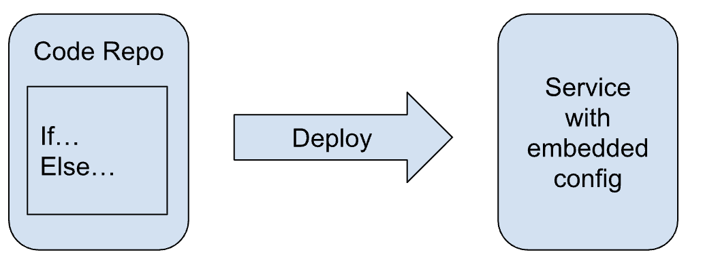
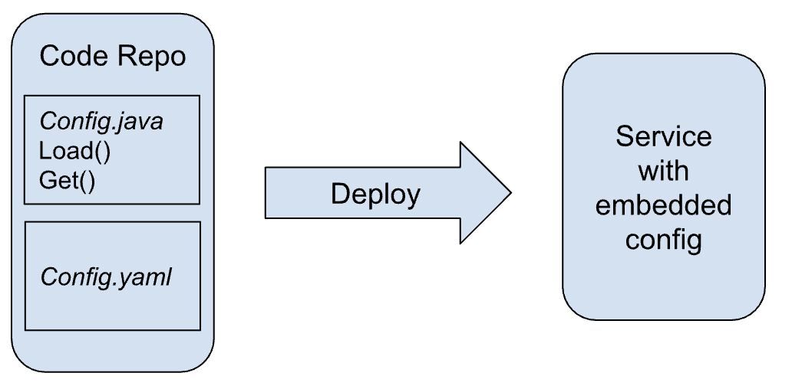
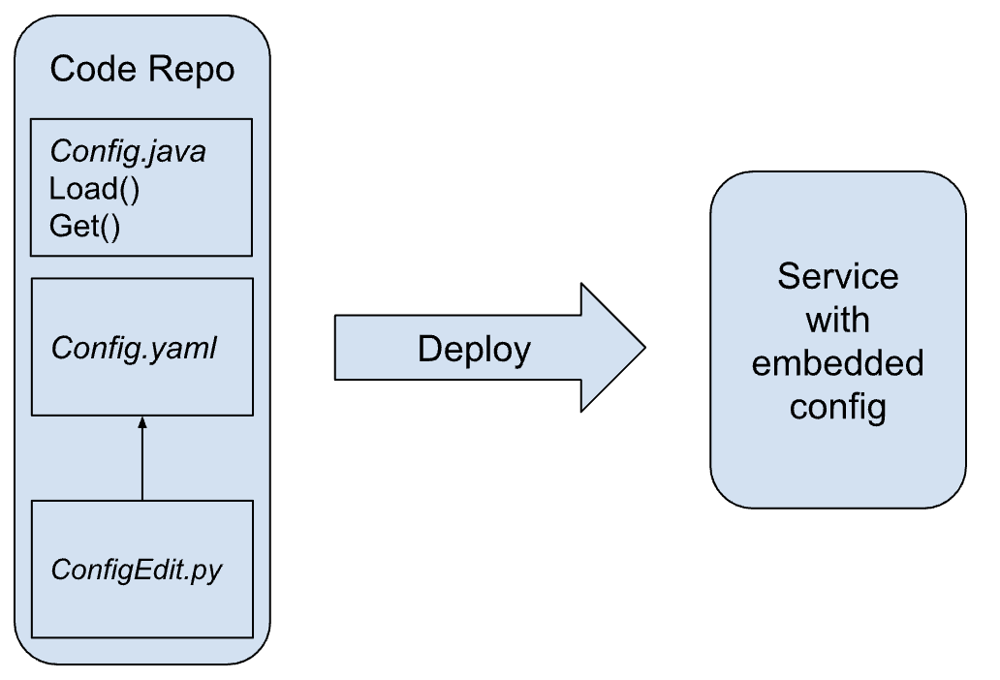
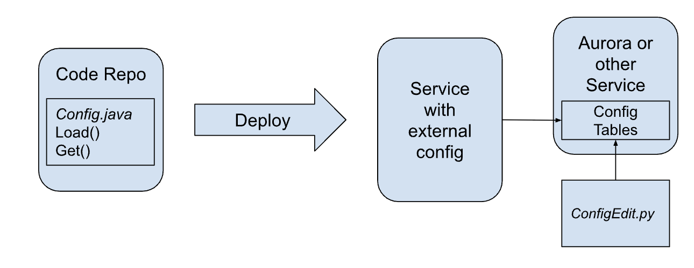
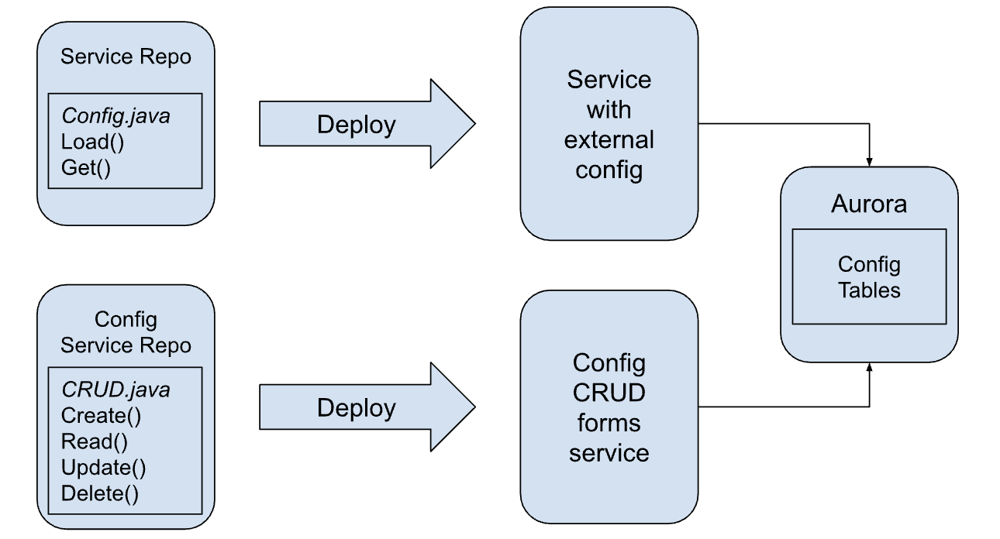
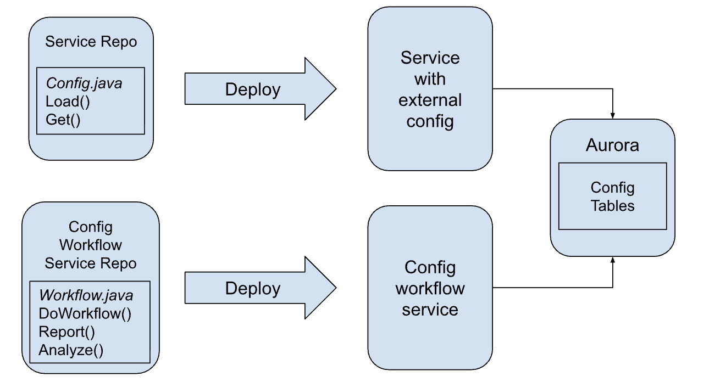

# Levels of Configuration and Tooling Maturity

I’ve repeatedly had conversations about automating extremely manual internal business processes framed as all or nothing propositions. Either we perpetuate the status quo, where changing system variables like tax categorization tables requires software developers and code changes, or we build a full fledged suite of self-service administrative tools so that internal administrators can own the problem without any engineering support.

The status quo is unpleasant, because it makes our customers completely dependent on engineering schedules to do their jobs and breeds dissatisfaction with our users.

Total self-service automation is often unachievable, because building such a toolset requires the collaboration of multiple engineering teams inside and outside our org over multiple years, and requires integration into the business workflows of our users.

What’s lacking in this conversation is the recognition that internal tooling exists on a spectrum of maturity where we trade engineering investment for customer empowerment to various degrees. 

## 0. Code is configuration

There is zero separation between code and configuration. Parameters like product IDs, pricing models, event prefixes, and usage quantities are hard coded into the code’s logic. 

Imagine we wanted to build a product catalog that represents everything we sell at our company, and how much we charge for it. In our example, the product catalog is a giant nest if/then/else statements. Every requested change to the product’s configuration by the business is a code change requiring an engineer, unit tests, regression tests, and a deployment. Dev toil is high. Users are frustrated by poor turnaround time.

A real example is a Billing invoice generator. Invoices are generated by code directly constructing the markup of a PDF file. There is no template involved. Changing the billing entity address for Singapore customers is a multi-sprint effort.

## 1. Code adjacent configuration

There is separation between code and configuration, but the configuration is checked into the same source repository as the code. Configuration is defined in JSON, YAML, XML, or some other domain specific language and loaded when the service boots.

A frequently encountered problem with configuration in code, or adjacent to code, is that configuration must often be duplicated between services. With every service repo having a separate copy of a connection string, there is no easy way to deploy synchronized changes. Moving configuration to a separate store solves this problem.

In our example, the product catalog is one big XML file in the service’s resources directory.

Every requested change to the product’s configuration still involves a developer, but the code itself doesn’t have to change. Changes still require testing and deployments, because configuration changes could be malformed and configuration is bundled into the deployable artifact. At least the code itself doesn’t change with each configuration change, so changes are far less risky.

## 2. Developer-centric configuration tooling

Configuration is still stored in the same repository as the code, but now some scripts have been written to automate common updates. Linters verify the config files are syntactically correct and check for any semantic violations. Update scripts might insert or update frequently changing data into the config files. A command line consistency validator might even execute the same configuration parsing and loading code used by the service at runtime to help validate builds during CI.

In our example, the product catalog is one big XML file in the service’s resources directory, but now we have some developer tooling in place to work with it, and the build fails if the catalog is malformed.

Every requested change to the product’s configuration still involves a developer, but the code itself doesn’t have to change and the changes are really quick due to developer automation. Deployment testing is minimal because errors are caught in CI. If the service successfully builds, we can be reasonably sure its configuration is correct.

## 3. Configuration as externalized data

Configuration has been moved to an independent store outside the code base. It could be in a database. It could be a static config file in an S3 bucket. It could be another service owned by a different team altogether. The important distinction is that code and configuration are no longer coupled in the timeline. Each is free to evolve on its own accord, and each can have a different owner. 

There is no user interface yet for manipulating configuration, but we may have some rudimentary developer-centric tools inherited from previous work that can be adapted to working with an external config source. At least we don’t have to redeploy software every time we want to change config. 

In our example, the product catalog has been moved to database tables stored in the cloud. The developer tools have been adapted to work with the database, and the service now picks up configuration changes automatically as the data in the database changes.

Owning the product’s configuration is now something that can be shared between developers and trusted power users. The configuration tools don’t touch code, and try their best to ensure syntactic and semantic correctness. They still have sharp edges, so they aren’t appropriate for general availability. Configuration deployments are pretty safe and don’t require downtime.

## 4. Forms over tables

Configuration has a primitive user interface. The interface doesn’t hide any complexity and exposes internal schema details to the user, but it doesn’t need a developer to operate. Administrators can create, read, update, and delete configuration primitives from the config store, but workflow is a human process. Configuration administration is guided by run books and oral tradition, which need to be updated every time the process changes.

In our example, the product catalog now has a rudimentary user interface. Billing and sales administrators can update the contents of the catalog without involving any developers, but the catalog isn’t presented in terms that reflect their worldview.

In our example, product configuration is now entirely owned by internal administrators. It is the administrator’s responsibility to “think like a developer” to translate the requirements of the business into their underlying constructs. Mistakes are often made requiring developer intervention to untangle. When they happen they are expensive and complicated. Removing developers from the configuration loop means that developers no longer have situational awareness of how their services are configured in production. Creative administrators are free to configure the system in ways developers did not anticipate, causing all kinds of problems and edge cases.

## 5. Configuration is a product

Internal tooling now automates common administrative workflows, synthesizes configuration and runtime data into helpful diagnostic views and reports, and provides controlled overrides so advanced administrators can handle non-standard situations. The configuration and administration system presents business-focused operations to non-technical users who think in business terms, not developer terms. Internal configuration and administration of our system is given the same design attention as the publicly facing features.

In our example, the product catalog is a fully featured application. Product managers have workflows for managing the capabilities they sell. The Go To Market team has workflows for managing which product bundles are available for public and sales-led self-service selection. The Pricing Strategy teams have tools on hand to give them fine-grained control over product prices, and what-if scenario planning tools help them iterate in a rapidly evolving product landscape. 

Product configuration is now distributed across the company. Different roles have access to different tools. Safety and guardrails are built in at every level. Administrative actions are authenticated, authorized, logged, and audited.

## Evolving towards maturity

As we design new products and negotiate their requirements, it's important to remember that internal administrators are still users of our systems. Neglecting their needs has real financial consequences. 

That said, we can’t let perfect be the enemy of good. The spectrum above gives useful anchors for framing the discussion around internal administration. For a new product’s launch, perhaps we don’t need a fully featured configuration story. Maybe we can get away with just automating the most important actions, but as a product matures and more revenue is on the line, the need for safe self-service administration increases. 

Instead of declaring “we can’t do anything because we have to do everything!”, look to this framework for the next evolutionary step.
