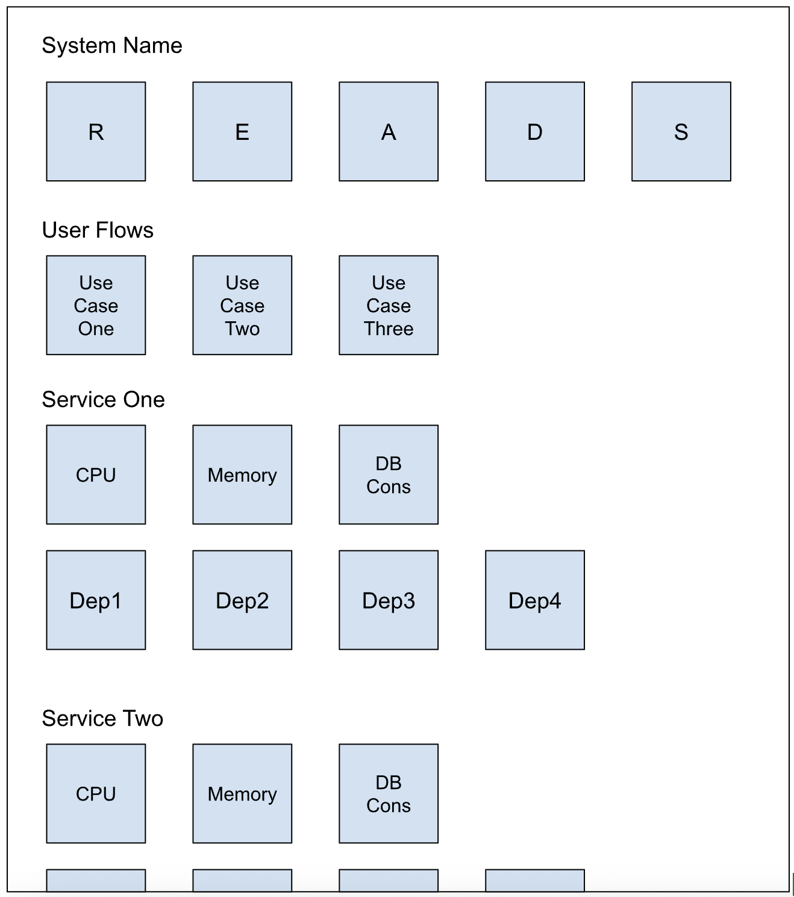

# Standardized Billing Metrics

Metrics, dashboards, and alerts are essential for comprehensive observability of our services and for preventing production incidents. There are three main categories of observability signals, and each system needs adequate coverage in each category to be well monitored.

The high-level categories are:

* __Business process metrics__ – These metrics measure the success and failure rates of your core business use cases from your users’ perspective. They help you quickly identify user-facing problems and assess incident impact.
* __Service operation metrics__ – These metrics track the performance of your system’s services from a technical perspective. They help you quickly identify which services are unhealthy and provide insights into why.
* __Downstream dependency metrics__ – These metrics track the behavior of your system’s downstream dependencies. They help you quickly differentiate between failures caused by your own services and failures cascading from dependencies.

> _Systems vs. Services_
>
> It’s important to think critically about the granularity of observability dashboards and reports. We often think in terms of services, even though we build and monitor systems. Use cases like billing event ingestion, account upgrades, and invoice generation arise from the collaboration of multiple services within a system.
>
> When building dashboards and reports, it helps to group metrics from collaborating services together into a system-level perspective, rather than having to look at many service-specific dashboards side by side.

## Business Process Metrics

Business process metrics measure your system’s health from your customer’s perspective by instrumenting the user journeys through your product.

For some systems, the customers are humans completing product tasks. For others, the customers are other internal services completing automated tasks. Either way, business process metrics measure the customer’s experience, not just technical service health. If a user can’t upgrade their account, it doesn’t matter if each service is “technically available.”

Business process metrics are inherently tied to product requirements, so they can rarely be derived from standard operational metrics published by technology stacks, like CPU and memory usage or HTTP success rate. It’s up to you and your team to decide what represents the success or failure of a business process and insert custom metrics in your code.

Business process metrics are often the first indicators that something is wrong with your system. An important business capability suddenly becoming unavailable tells you that something is wrong, but not what or why. Alerts on these metrics are the canary in your observability coal mine.

## Service Operation Metrics

Service operation metrics measure each service’s health from a developer’s perspective by instrumenting the runtime behavior of each service.

Service operation metrics include CPU and memory usage, requests per second, request latency, and response code counts. These metrics are often auto-generated by frameworks and tools, and are most useful for identifying the symptoms of an incident.

## Downstream Dependency Metrics

Downstream dependency metrics measure your system’s dependencies from each service’s perspective, by instrumenting successes and failures when communicating with downstream systems.

Downstream dependency metrics include request count, latency, and error rates from the perspective of your services as clients of your dependencies. These metrics are sometimes auto-generated by frameworks and tools, and are useful for quickly identifying cascading failures caused by failing dependencies.

> _Being available when dependencies fail_
>
> When your service is unavailable due to downstream dependency failure, your service is still experiencing an outage and you are still having an incident. Downstream dependency failure is not an excuse for every outage. It’s your responsibility to make your services as resilient as possible to failures in downstream dependencies.
>
> Techniques for improving resiliency in the face of downstream dependency failure include retries, asynchronous processing for complex or long-running tasks, and returning default responses in the face of an error. It’s not possible to account for every possible downstream failure, but there is no excuse for ignoring resiliency entirely.

## Golden Signals

The metrics and dashboards used by each system should be tailored to the needs of each system and its operators. Every system is unique, and so should every system’s monitoring. However, while customization is encouraged, some metrics are so essential that they must be published and alerted upon by every service. These metrics are known as Golden Signals, of which there are five (READS):

* Requests
* Errors
* Availability
* Duration
* Saturation

### Requests

The requests metric tracks the rate at which requests are received by a service. This metric is useful for establishing a usage baseline, capacity planning, and detecting changes in caller behavior.

In Datadog, this metric is interpreted as a rate per second or minute. From this metric, you can infer the sustained load (average) and peak load (max) of a service. Sudden changes in requests are indicative of a change in your service’s callers, possibly in error.

This metric is a rate-type metric incremented every time a request is received.

### Errors

The errors metric tracks the rate at which response errors are returned by a service. Changes in the error rate are indicative of a bug, regression, or failed dependency.

Errors can come from many sources. Unhandled exceptions, 5xx errors, or unexpected circumstances may all increment an error metric. Metric tagging should be used to classify errors by category, to allow for nuanced investigation in Datadog.

It’s important to distinguish service errors from user errors. If a user submits an invalid request, returning a 4xx response is the correct behavior for the service. Don’t record this response as an error. Depending on your use case, it may make sense to create a separate business process metric to track invalid request handling.

In Datadog, this metric is interpreted as a rate per second or minute. It’s often valuable to break out errors by category using tags.

This metric is a rate-type metric incremented every time an error is returned.

### Availability

Availability is the numeric interpretation of your SLIs/SLOs. It represents your system’s ability to satisfy its stated business purpose over time. Since this metric is based on business process metrics, it’s more open to interpretation.

This metric should not be confused with uptime or liveness, which merely measure that a service is running. Uptime and liveness are a “dial tone” that only indicate a service is online; they say nothing about the service’s ability to satisfy customer needs.

In Datadog, this metric is interpreted as a percentage between zero and one, with one representing available. This metric is averaged over time from one or more underlying sources.

This metric is usually derived from the interaction of other metrics.

### Duration

Duration is the time taken to successfully satisfy a request—the delta between the time a request is received and a response is returned. It’s typically measured in milliseconds.

It’s important not to blend success and error durations in a single metric. Errors often return much faster than successes, so an increase in error rate can counterintuitively decrease average duration. Either measure only success duration, or distinguish successes from errors using tags.

In Datadog, this metric is interpreted with percentiles (p99, p95, p50). A simple average hides long-tail effects, where a small number of requests suffer significant latency.

This metric is a distribution-type metric, appended to on each request.

### Saturation

Saturation represents a service’s consumption of its environment’s finite resources. These can include memory, CPU, disk space, queue depth, or database connections. The top-level saturation metric for a service is derived from the service’s most constrained resource.

We track saturation so we can detect when a service is close to exhausting its resources. Sudden changes in saturation are a strong indicator of a pending incident or a newly introduced bug.

In Datadog, this metric is interpreted as a percentage between zero and one, with one representing a completely exhausted resource.

This metric is a gauge-type metric, updated when resource consumption changes.

## A Well-Structured Dashboard

A well-structured dashboard groups together operationally critical business, service, dependency, and READS metrics into a single page. A great dashboard is a powerful tool for monitoring regressions during a deployment and finding the source of an error during an incident.

## Effective Alerting

Collecting metrics and showing dashboards isn’t useful if you aren’t alerted to problems when they happen. Your business process metrics are a great starting point for alerting, because they represent how your users experience your system. If users are impacted, you really want to know.

Rob Ewaschuk from Google’s SRE team concisely covers the topic in [My Philosophy on Alerting](https://docs.google.com/document/d/199PqyG3UsyXlwieHaqbGiWVa8eMWi8zzAn0YfcApr8Q/edit?usp=sharing). Go read it—it’s really good! His TL;DR is:

* Pages should be urgent, important, actionable, and real.
* They should represent either ongoing or imminent problems with your service.
* Err on the side of removing noisy alerts—over-monitoring is a harder problem to solve than under-monitoring.
* You should almost always be able to classify the problem into one of: availability & basic functionality; latency; correctness (completeness, freshness, and durability of data); and feature-specific problems.
* Symptoms are a better way to capture more problems more comprehensively and robustly with less effort.
* Include cause-based information in symptom-based pages or on dashboards, but avoid alerting directly on causes.
* The further up your serving stack you go, the more distinct problems you catch in a single rule. But don't go so far you can't sufficiently distinguish what's going on.
* If you want a quiet on-call rotation, it's imperative to have a system for dealing with things that need timely response, but are not imminently critical.

To Rob’s work, I’d like to add the following:

* Every alert in PagerDuty must have a link to a run book for triaging, diagnosing, and fixing the alert, along with any other contacts that might be needed to help.
* Any alert that indicates an incident should be marked with “Report an incident now” in the run book. We can always downgrade later if there is no customer impact. The on-call engineer shouldn’t need to make that call bleary-eyed at two in the morning with insufficient context.
* Alerts that are important, but not customer-impacting, should not page an engineer outside of business hours.

_Don’t ruin your team members’ evenings or wake them up at two in the morning to deal with a situation that can wait until the next day. Alert fatigue is real, and the fear of after-hours alerts is a major cause of burnout._

## Resources

* https://www.blameless.com/sre/4-sre-golden-signals-what-they-are-and-why-they-matter
* https://engineering.salesforce.com/reads-service-health-metrics-1bfa99033adc
* https://docs.datadoghq.com/metrics/types/
* [My Philosophy on Alerting](https://docs.google.com/document/d/199PqyG3UsyXlwieHaqbGiWVa8eMWi8zzAn0YfcApr8Q/edit?usp=sharing)
* https://newrelic.com/resources/ebooks/effective-alerting-guide
